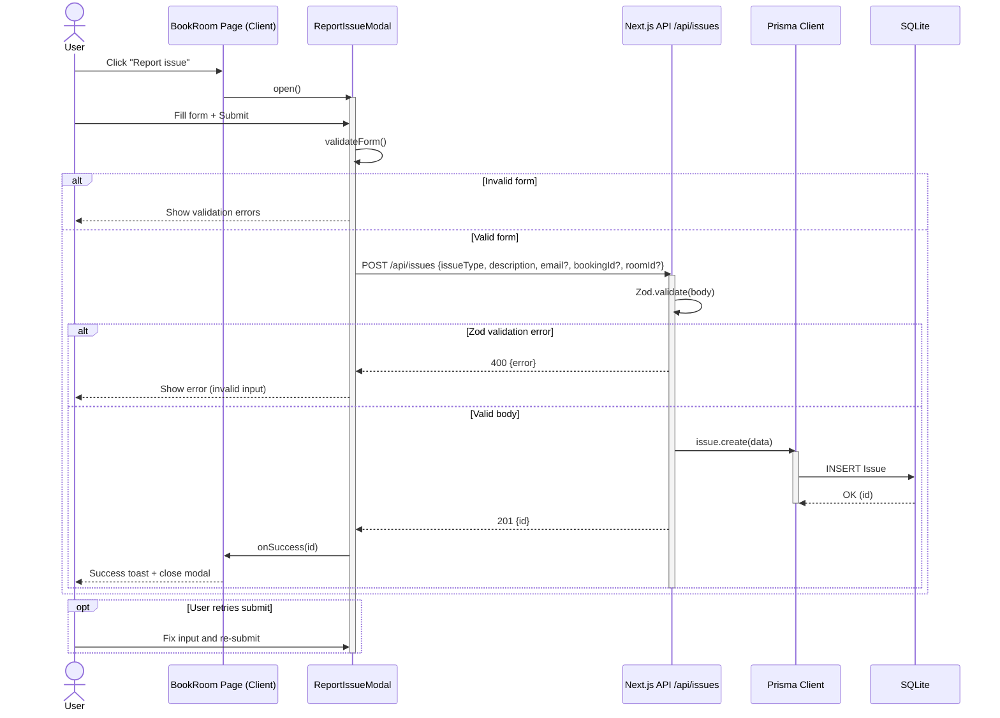
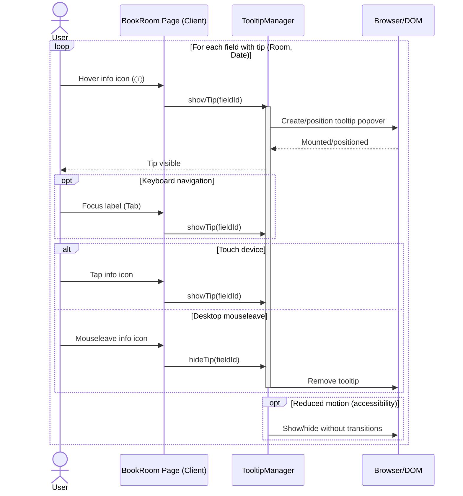

### CSCI 362 - Assignment 6: Sequence Diagrams

#### Feature 1: Report an Issue flow

```mermaid
sequenceDiagram
  actor User
  participant Page as BookRoom Page (Client)
  participant Modal as ReportIssueModal
  participant API as Next.js API /api/issues
  participant Prisma as Prisma Client
  participant DB as SQLite

  User->>Page: Click "Report issue"
  Page->>Modal: open()
  activate Modal
  User->>Modal: Fill form + Submit
  Modal->>Modal: validateForm()

  alt Invalid form
    Modal-->>User: Show validation errors
  else Valid form
    Modal->>API: POST /api/issues {issueType, description, email?, bookingId?, roomId?}
    activate API
    API->>API: Zod.validate(body)

    alt Zod validation error
      API-->>Modal: 400 {error}
      Modal-->>User: Show error (invalid input)
    else Valid body
      API->>Prisma: issue.create(data)
      activate Prisma
      Prisma->>DB: INSERT Issue
      DB-->>Prisma: OK (id)
      deactivate Prisma
      API-->>Modal: 201 {id}
      Modal->>Page: onSuccess(id)
      Page-->>User: Success toast + close modal
    end
    deactivate API
  end

  opt User retries submit
    User->>Modal: Fix input and re-submit
  end
  deactivate Modal
```

#### Feature 2: Inline Tips on Booking Fields

```mermaid
sequenceDiagram
  actor User
  participant Page as BookRoom Page (Client)
  participant Tooltip as TooltipManager
  participant DOM as Browser/DOM

  loop For each field with tip (Room, Date)
    User->>Page: Hover info icon (ⓘ)
    Page->>Tooltip: showTip(fieldId)
    activate Tooltip
    Tooltip->>DOM: Create/position tooltip popover
    DOM-->>Tooltip: Mounted/positioned
    Tooltip-->>User: Tip visible

    opt Keyboard navigation
      User->>Page: Focus label (Tab)
      Page->>Tooltip: showTip(fieldId)
    end

    alt Touch device
      User->>Page: Tap info icon
      Page->>Tooltip: showTip(fieldId)
    else Desktop mouseleave
      User->>Page: Mouseleave info icon
      Page->>Tooltip: hideTip(fieldId)
      Tooltip->>DOM: Remove tooltip
      deactivate Tooltip
    end

    opt Reduced motion (accessibility)
      Tooltip->>DOM: Show/hide without transitions
    end
  end
```
